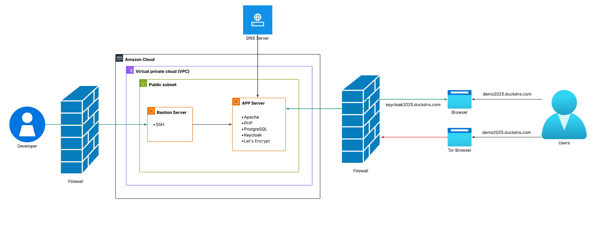
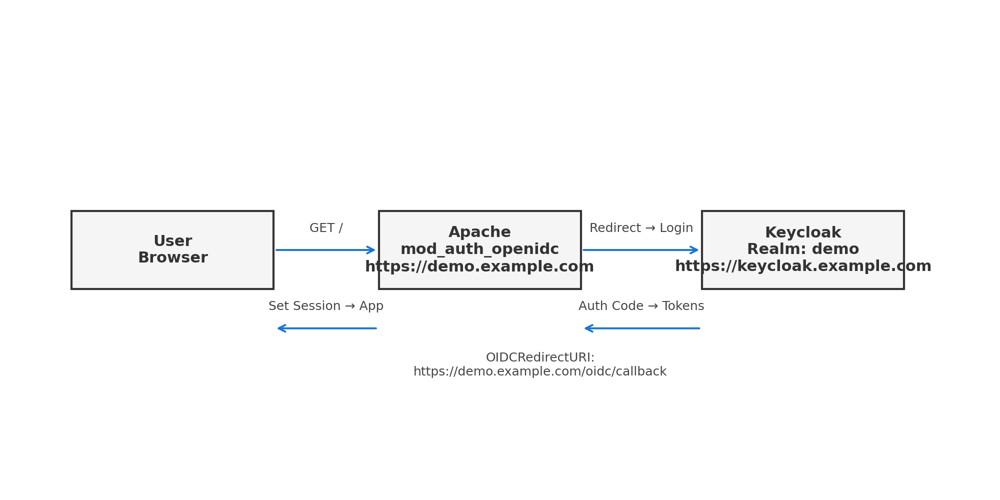
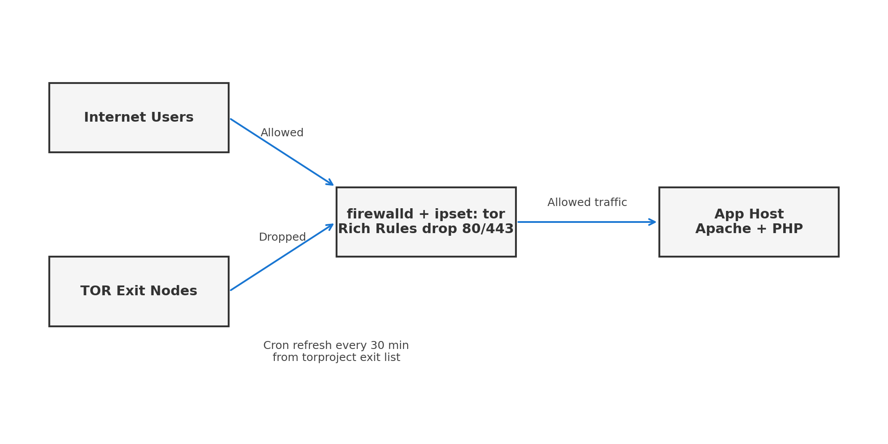

# 🔐 Secure App Stack

[]()
[]()
[]()
[]()

A Linux infrastructure project implementing a **secure PHP/Postgres web app** protected with **Keycloak (OIDC)**, served over **HTTPS (Let’s Encrypt)**, accessible only via a **jump host**, and hardened against **TOR traffic**.

---

## 📌 Features
- 🔑 **Authentication**: Keycloak OIDC integration with Apache `mod_auth_openidc`  
- 🗄️ **Database**: PostgreSQL backend for the PHP demo app  
- 🌐 **SSL/TLS**: Let’s Encrypt with HTTP → HTTPS redirect  
- 🚫 **Security**: Block TOR exit nodes via firewalld + ipset  
- 🖥️ **Infrastructure**: Jump host for SSH, root login disabled  
- 🕒 **Auditing**: Extended shell history & auditd enabled  

---

## 🏗️ Architecture



---

## 🔐 Authentication Flow



1. User browses `https://demo.example.com`  
2. Apache (mod_auth_openidc) redirects to Keycloak  
3. User authenticates in Keycloak realm  
4. Browser returns to demo app with session token  
5. PHP app loads only after successful authentication  

---

## 🛡️ TOR Blocking



- Exit node list refreshed every 30 minutes  
- Managed via `firewalld` + ipset  
- Ports 80/443 dropped for TOR sources  

---

## 🚀 Quick Start

### Clone repository
```bash
git clone https://github.com/<your-username>/secure-app-stack.git
cd secure-app-stack
```

### Run TOR blocklist refresh
```bash
sudo ./scripts/tor-blocklist-refresh.sh
```

### Apache configs
- Copy `apache/demo-ssl.conf` and `apache/keycloak-ssl.conf` to `/etc/apache2/sites-available/`  
- Enable sites:  
  ```bash
  sudo a2ensite demo-ssl.conf keycloak-ssl.conf
  sudo systemctl reload apache2
  ```

### Database init
```bash
sudo -u postgres psql -f sql/init-app-db.sql
sudo -u postgres psql -f sql/init-keycloak-db.sql
```

---

## 📑 Documentation
- [Setup Guide](docs/setup-guide.md) — full step-by-step instructions  
- [Apache Configs](apache/) — vhost configs + demo PHP app  
- [Scripts](scripts/) — TOR blocklist management  

---

## 📜 License

